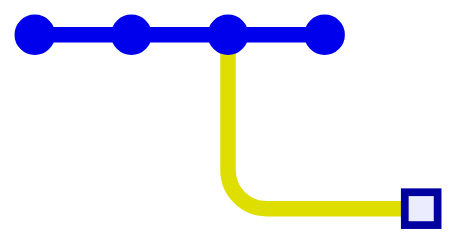
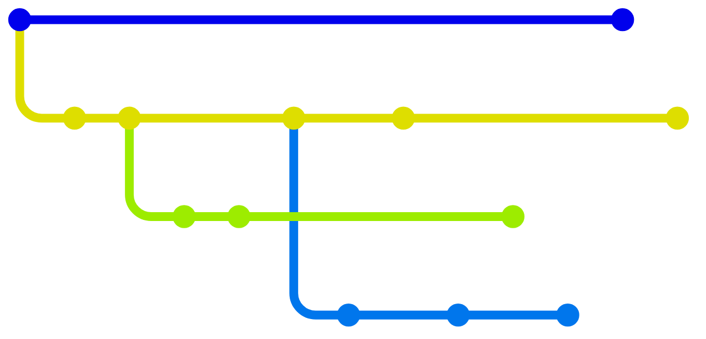
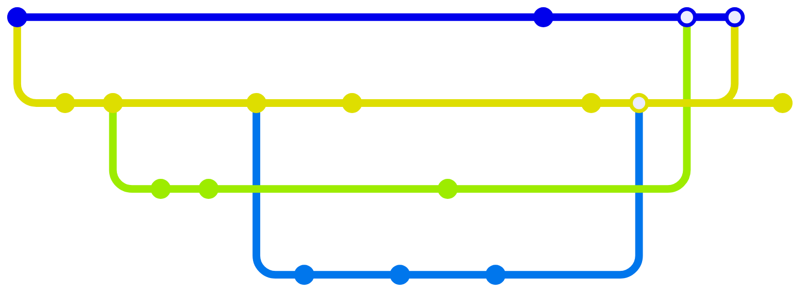

# Gitを「イメージ」する

様々な視点から

<div class="absolute bottom-10">Ama / Yuki Okugawa</div>

---
layout: image-right
image: "/me.jpg"
---

# 自己紹介 Ama

- 和歌山県立医科大学<br>医学部4年
- PG歴: 2年目(23年2月~)
- Backend (統括)
- 好きなもの: Neovim
- 最近: [Hono](https://hono.dev)を弄ってます

---
layout: section
---

# Git履歴のグラフ

---
layout: center
---

# Gitとは？

<v-clicks>

- 分散型
- <u>バージョン</u> 管理

</v-clicks>

---
layout: statement
---

# バージョン ≒ 履歴

---
layout: image
image: "/undo-redo.jpg"
---

---
layout: two-cols
transition: fade
---

# 履歴の変遷イメージ

<v-clicks>

- 変更する
- **コミット**として記録する

</v-clicks>

::right::
<div class="h-40"></div>


---
layout: two-cols
transition: fade
---

# 履歴の変遷イメージ

<ul>
<li>変更する</li>
<li><strong>コミット</strong>として記録する</li>
<v-click><li>1つ戻す</li></v-click>
</ul>

::right::
<div class="h-40"></div>


---
layout: two-cols
transition: fade
---

# 履歴の変遷イメージ

<ul>
<li>変更する</li>
<li><strong>コミット</strong>として記録する</li>
<li>1つ戻す</li>
<v-click><li>変更する</li></v-click>
<v-click><li>コミットする</li></v-click>
<v-click>→ 履歴はどうなる？</v-click>
</ul>

::right::
<div class="h-40"></div>


---
layout: two-cols
---

# 履歴の変遷イメージ

<ul>
<li>変更する</li>
<li><strong>コミット</strong>として記録する</li>
<li>1つ戻す</li>
<li>変更する</li>
<li>コミットする<ul>
	<li>"パラレルワールド"</li>
	<v-click><li>上書きはされない</li></v-click>
</ul></li>
</ul>

::right::
<div class="h-40"></div>



---
layout: center
transition: fade
---

# 履歴は **木構造** である



---
layout: center
---

# 分岐の逆： **マージ**



<v-click>

※ 数学的には <u>**有向非巡回グラフ**</u>

</v-click>

---

# マージの内部的手順

<v-clicks>

- 各コミット同士の **直近の分岐点** を見つける
- 分岐点からの **変更差分をそれぞれ計算**
- 競合していない差分を統合
- 競合が発見された場合、 **マージをブロック**
	- 手動で解決してもらう(**コンフリクト**)
- 競合が解消されたら、 **親が2つあるコミット (マージコミット)** を作成、ブランチの最新コミットを更新

</v-clicks>

---
layout: section
---

# Gitのデータ構造

---

# Gitのデータの場所

- **`.git`** ディレクトリに保存される

```txt {*}{maxHeight:'300px'}
.git/
├── index
│
├── HEAD
├── FETCH_HEAD
├── ORIG_HEAD
├── MERGE_HEAD
│
├── objects/
│   ├── 00/
│   │   └── ...
│   ├── 01/
│   │   └── ...
│   ├ ...
│   ├ ...
│   │
│   ├── ff/
│   │   └── ...
│   ├── info/
│   └── pack/
│
├── refs/
│   ├── heads/
│   │   ├── feat/
│   │   │   └─ signup
│   │   └── main
│   ├── remotes/
│   │   ├── origin/
│   │   │   ├─ HEAD
│   │   │   └─ main
│   │   └── upstream/
│   │       └── ...
│   ├── stash
│   └── tags/
│       ├── v1.0.0
│       └── v1.0.1
│
│
├── COMMIT_EDITMSG
├── config
├── info/
│   └── exclude
├── hooks/
:

```

---
layout: two-cols-header
---

# オブジェクトについて

<div class="h-8"></div>

各データは**オブジェクト**として保存。

::left::

<v-clicks>

- テキスト/バイナリ ファイルのコピー
- ディレクトリツリー
- コミット
- (注釈付き)タグ

</v-clicks>

::right::


<v-clicks>

- ファイル関連オブジェクト
	- **Blob** オブジェクト
	- **Tree** オブジェクト
- **Commit** オブジェクト
- **Tag** オブジェクト

</v-clicks>

---
layout: center
---

オブジェクトを理解したい。

<v-click>

→ **1コミット** あたり記録している内容を見ていこう。

</v-click>

---
layout: image-right
image: ""
---

# 1コミットの情報

<v-clicks>

- <u>**ファイルとディレクトリ**</u>
	- 各ファイルの配置と<br>バイナリデータ
- <u>**親コミットの _ID_**</u>
- その他のデータ
	- コミットメッセージ, ユーザー, 時刻, ……

</v-clicks>

---

# ファイル関連オブジェクト

<div class="h-10"></div>

**⚠ よくある誤解**

<v-clicks>

- 誤：コミットは **変更差分** を記録している
- 正：コミットは **スナップショット** を記録している

</v-clicks>

<v-click>

<div class="h-10"></div>

<center>

※ ファイルを一部変更しても<u>別の**オブジェクト**</u>が作られる

</center>

</v-click>

---

# ファイル関連オブジェクト

- **Blob** オブジェクト
	- ファイルのバイナリデータ (gzip圧縮)
	- ファイル名は保存されない
- **Tree** オブジェクト
	- ディレクトリの構造
	- ファイル名 → Blobオブジェクトの _ID_ の関連付け
	- サブディレクトリ名 → Treeオブジェクトの _ID_ の関連付け

---
layout: center
---

<div class="m-40">


引用元：[Gitの内側 - Gitオブジェクト](https://git-scm.com/book/ja/v2/Gitの内側-Gitオブジェクト)

</div>

---

# Commit オブジェクト

**コミット**1つに対応するオブジェクト。

<v-clicks>

- **Tree** オブジェクト
	- プロジェクトルートのファイル/ディレクトリ配置

- 親の **Commit** オブジェクトの _ID_
	- 1つのコミットには1つ以上の親がある
- コミットメッセージ, ユーザー, 時刻, ……

</v-clicks>

---

# Tag オブジェクト

**<u>注釈付き</u>タグ**1つに対応するオブジェクト。

<v-clicks>

<div class="bg-gray-100 p-3 rounded-lg m-6">
<h3>注釈付きタグとは？</h3>
<hr class="m-2">
<ul>
<li class="text-lg"><strong>軽量タグ</strong>：単なるオブジェクトのエイリアス</li>
<li class="text-lg"><strong>注釈付きタグ</strong>：各オブジェクトにメッセージを保存できる。タグ作成者や時刻も記録</li>
</ul>
</div>

- タグが指す オブジェクトの _ID_
- タグ名
- 作成者, 時刻, メッセージ

</v-clicks>

<!-- TODO: 注釈付きタグと軽量タグの違いの図解 -->

---

# _オブジェクトID_ とは？

- オブジェクトを表すファイルのハッシュ値を取ったもの。
- **SHA-1** ハッシュ関数を使用。

```txt
.git/
└── objects/
    ├── 00/
    │   ├── 97207263d15baa30c1559b4fcb2f98d0f12707
    │   └── ...
    ├── 01/
    │   ├── edc5fe71971e9ffa5b0e57dc55a5c48a258ad5
    │   └── ...
    ├ ...
    ├ ...
    │
    └── ff/
        └── ...
```

---
layout: end
---
