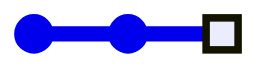
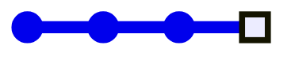
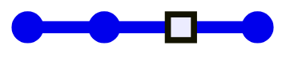
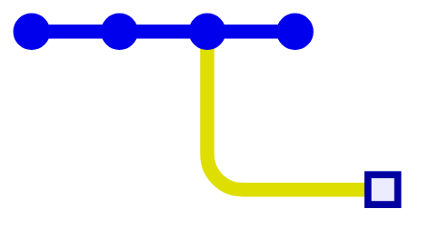
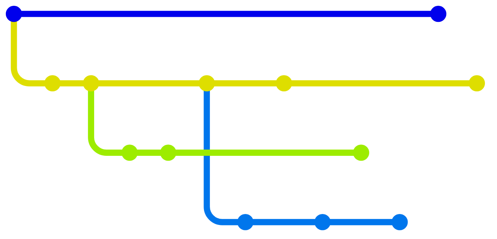
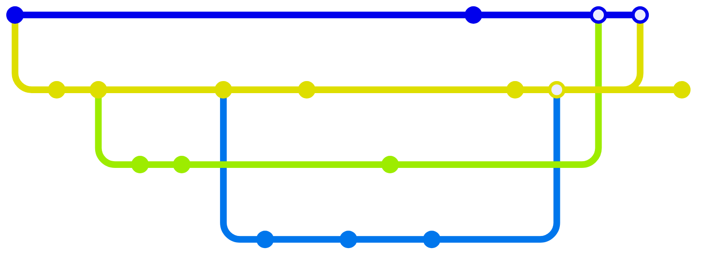

# Gitを「イメージ」する

様々な視点から

Ama / Yuki Okugawa

---
layout: image-right
image: "/me.jpg"
---

# 自己紹介 Ama

- 和歌山県立医科大学 医学部4年
- PG歴: 2年目(23年2月~)
- Backend (統括)
- 好きなもの: Neovim
- 最近: [Hono](https://hono.dev)を弄ってます

---
layout: section
---

# Git履歴のグラフ

---
layout: center
---

# Gitとは？

<v-clicks>

- 分散型
- <u>バージョン</u> 管理

</v-clicks>

---
layout: statement
---

# バージョン ≒ 履歴

---
layout: image
image: "/undo-redo.jpg"
---

---
layout: two-cols
transition: fade
---

# 履歴の変遷イメージ

<v-clicks>

- 変更する
- **コミット**として記録する

</v-clicks>

::right::

---
layout: two-cols
transition: fade
---

# 履歴の変遷イメージ

<ul>
<li>変更する</li>
<li><strong>コミット</strong>として記録する</li>
<v-click><li>1つ戻す</li></v-click>
</ul>

::right::

---
layout: two-cols
transition: fade
---

# 履歴の変遷イメージ

<ul>
<li>変更する</li>
<li><strong>コミット</strong>として記録する</li>
<li>1つ戻す</li>
<v-click><li>変更する</li></v-click>
<v-click><li>コミットする</li></v-click>
<v-click>→ 履歴はどうなる？</v-click>
</ul>

::right::

---
layout: two-cols
---

# 履歴の変遷イメージ

<ul>
<li>変更する</li>
<li><strong>コミット</strong>として記録する</li>
<li>1つ戻す</li>
<li>変更する</li>
<li>コミットする<ul>
	<li>"パラレルワールド"</li>
	<v-click><li>上書きはされない</li></v-click>
</ul></li>
</ul>

::right::

---
layout: center
transition: fade
---

# 履歴は **木構造** である

---
layout: center
---

# 分岐の逆： **マージ**

<v-click>

※ 数学的には <u>**有向非巡回グラフ**</u>

</v-click>

---

# マージの内部的手順

<v-clicks>

- 各コミット同士の **直近の分岐点** を見つける
- 分岐点からの **変更差分をそれぞれ計算**
- 競合していない差分を統合
- 競合が発見された場合、 **マージをブロック**
	- 手動で解決してもらう(**コンフリクト**)
- 競合が解消されたら、 **親が2つあるコミット (マージコミット)** を作成、ブランチの最新コミットを更新

</v-clicks>

---
layout: end
---
