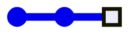
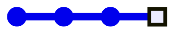
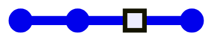
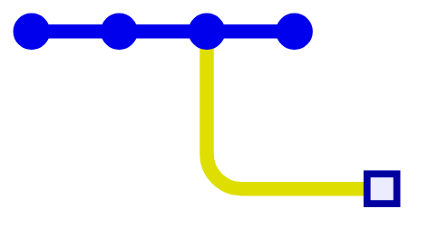
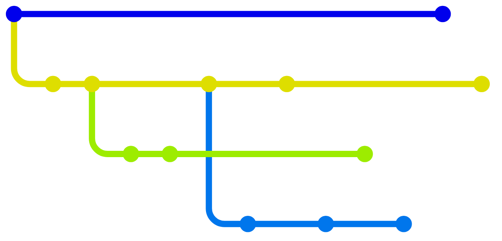
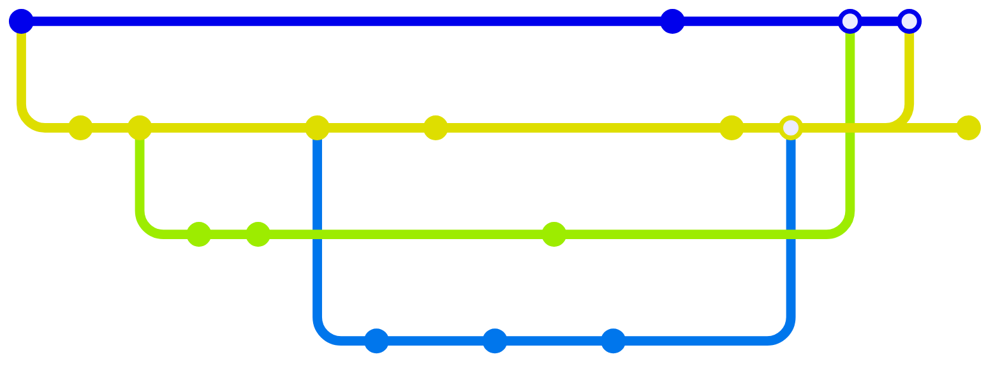
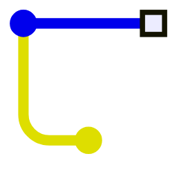
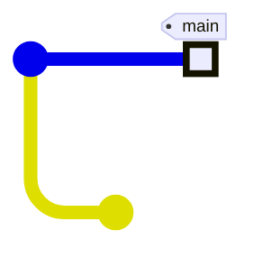
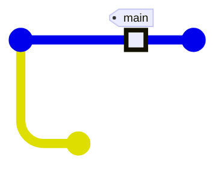
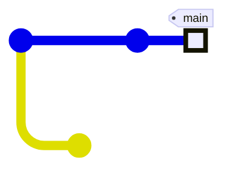

# Gitを「イメージ」する

様々な視点から

<div class="absolute bottom-10">Ama / Yuki Okugawa</div>

---
layout: image-right
image: "/me.jpg"
---

# 自己紹介 Ama

- 和歌山県立医科大学<br>医学部4年
- PG歴: 2年目(23年2月~)
- Backend (統括)
- 好きなもの: Neovim
- 最近: [Hono](https://hono.dev)を弄ってます

---
layout: section
---

# Git履歴のグラフ

---
layout: center
---

# Gitとは？

<v-clicks>

- 分散型
- <u>バージョン</u>管理

</v-clicks>

---
layout: statement
---

<v-switch>
<template #0>

バージョンとは？

</template>
<template #1>

# バージョン ≒ 履歴

</template>
</v-switch>


---
layout: image
image: "/undo-redo.jpg"
---

---
layout: two-cols
transition: fade
---

# 履歴の変遷イメージ

<ul>
<li v-click=1>変更する</li>
<li v-click=2><strong>コミット</strong>として記録する</li>
<li v-click=4>1つ戻す</li>
<li v-click=6>変更する</li>
<v-switch at=7>
	<template #0-2>
		<li>
			コミットする
		</li>
		<div v-click=7>→ 履歴はどうなる？</div>
	</template>
	<template #2>
		<li>
			コミットする
			<ul>
				<li>"パラレルワールド"</li>
				<li>上書きはされない</li>
			</ul>
		</li>
	</template>
</v-switch>
</ul>

::right::
<div class="h-40"></div>

<v-switch at=1>
<template #0-3>



</template>
<template #3-5>



</template>
<template #5-8>



</template>
<template #8>



</template>
</v-switch>

---
layout: center
transition: fade
---

# 履歴は **木構造** である



---
layout: center
---

# 分岐の逆： **マージ**



<v-click>

※ 数学的には <u>**有向非巡回グラフ**</u>

</v-click>

---

# マージの内部的手順

<v-clicks>

- 各コミット同士の **直近の分岐点** を見つける
- 分岐点からの **変更差分をそれぞれ計算**
- 競合していない差分を統合
- 競合が発見された場合、 **マージをブロック**
	- 手動で解決してもらう(**コンフリクト**)
- 競合が解消されたら、 **親が2つあるコミット (マージコミット)** を作成、ブランチの最新コミットを更新

</v-clicks>

---
layout: section
---

# Gitのデータ構造

---

# Gitのデータの場所

- **`.git`** ディレクトリに保存される

```txt {*}{maxHeight:'300px'}
.git/
├── index
│
├── HEAD
├── FETCH_HEAD
├── ORIG_HEAD
├── MERGE_HEAD
│
├── objects/
│   ├── 00/
│   │   └── ...
│   ├── 01/
│   │   └── ...
│   ├ ...
│   ├ ...
│   │
│   ├── ff/
│   │   └── ...
│   │
│   ├── info/
│   └── pack/
│
├── refs/
│   ├── heads/
│   │   ├── feat/
│   │   │   └─ signup
│   │   └── main
│   ├── remotes/
│   │   ├── origin/
│   │   │   ├─ HEAD
│   │   │   └─ main
│   │   └── upstream/
│   │       └── ...
│   ├── stash
│   └── tags/
│       ├── v1.0.0
│       └── v1.0.1
│
│
├── COMMIT_EDITMSG
├── config
├── info/
│   └── exclude
├── hooks/
:

```

---
layout: two-cols-header
---

# オブジェクトについて

<div class="h-8"></div>

各データは**オブジェクト**として保存。

::left::

<v-clicks>

- テキスト/バイナリ ファイルのコピー
- ディレクトリツリー
- コミット
- (注釈付き)タグ

</v-clicks>

::right::


<v-clicks>

- ファイル関連オブジェクト
	- **Blob** オブジェクト
	- **Tree** オブジェクト
- **Commit** オブジェクト
- **Tag** オブジェクト

</v-clicks>

---
layout: center
---

オブジェクトを理解したい。

<v-click>

→ **1コミット** あたり記録している内容を見ていこう。

</v-click>

---
layout: image-right
image: ""
---

# 1コミットの情報

<v-clicks>

- <u>**ファイルとディレクトリ**</u>
	- 各ファイルの配置と<br>バイナリデータ
- <u>**親コミットの _ID_**</u>
- その他のデータ
	- コミットメッセージ, ユーザー, 時刻, ……

</v-clicks>

---
layout: center
---

# ここからは

<v-click>

# <u>さっきの情報とオブジェクトの対応</u>を

</v-click>

# 想像しながら聞いてください

---

# ファイル関連オブジェクト

<div class="h-10"></div>

**⚠ よくある誤解**

<v-clicks>

- 誤：コミットは **変更差分** を記録している
- 正：コミットは **スナップショット** を記録している

</v-clicks>

<div class="flex flex-col items-center justify-evenly">
	<p v-click>
		ファイルを一部変更しても<u>別の<strong>オブジェクト</strong></u>が作られる
	</p>
	<p v-click>
		※ 複数オブジェクトの圧縮保管の際に適宜差分を取る (Packfile)
	</p>
</div>

---

# ファイル関連オブジェクト

- **Blob** オブジェクト
	- ファイルのバイナリデータ (gzip圧縮)
	- ファイル名は保存されない
- **Tree** オブジェクト
	- ディレクトリの構造
	- ファイル名 → Blobオブジェクトの _ID_ の関連付け
	- サブディレクトリ名 → Treeオブジェクトの _ID_ の関連付け

---
layout: center
---

<div class="m-40">


引用元：[Gitの内側 - Gitオブジェクト](https://git-scm.com/book/ja/v2/Gitの内側-Gitオブジェクト)

</div>

---

# Commit オブジェクト

**コミット**1つに対応するオブジェクト。

<v-clicks>

- **Tree** オブジェクト
	- プロジェクトルートのファイル/ディレクトリ配置

- 親の **Commit** オブジェクトの _ID_
	- 1つのコミットには1つ以上の親がある
- コミットメッセージ, ユーザー, 時刻, ……

</v-clicks>

---

# Tag オブジェクト

**<u>注釈付き</u>タグ**1つに対応するオブジェクト。

<v-clicks>

<div class="bg-gray-100 p-3 rounded-lg m-6 text-dark">
<h3>注釈付きタグとは？</h3>
<hr class="m-2">
<ul>
<li class="text-lg"><strong>軽量タグ</strong>：単なるオブジェクトのエイリアス</li>
<li class="text-lg"><strong>注釈付きタグ</strong>：各オブジェクトにメッセージを保存できる。タグ作成者や時刻も記録</li>
</ul>
</div>

- タグが指す オブジェクトの _ID_
- タグ名
- 作成者, 時刻, メッセージ

</v-clicks>

<!-- TODO: 注釈付きタグと軽量タグの違いの図解 -->

---

# _オブジェクトID_ とは？

- オブジェクトを表すファイルからハッシュ値を計算したもの
- **SHA-1**ハッシュ関数を使用

```txt {*}{maxHeight: '180px'}
.git/
└── objects/
    ├── 00/
    │   ├── 97207263d15baa30c1559b4fcb2f98d0f12707
    │   └── ...
    ├── 01/
    │   └── ...
    ├ ...
    │
    ├── ff/
    │   └── ...
    │
    ├── info/
    └── pack/
```

※ `objects/**` 内のファイルから直にSHA-1をとっている訳ではない。
(参照：[Git objects v2](http://www.slideshare.net/chinkouu/git-objects-v2))

<!-- pack や info については複数のオブジェクトを圧縮したデータとそのインデックス(後述する)。 -->

---
layout: section
---

# コミットのエイリアス

---
transition: fade
---

# コミットの指定方法

<div class="w-full flex items-center justify-center h-75">

<v-clicks>

**コミットID** (SHA-1ハッシュ値)

だけではないよね……？

</v-clicks>

</div>

---
layout: two-cols-header
---

# コミットの指定方法

::left::

<ul>
<li>
	<v-click at=4><strong>ブランチ</strong></v-click>
	<ul>
		<v-click at=1><li><code>main</code></li></v-click>
		<v-click at=2><li><code>origin/main</code></li></v-click>
		<v-click at=3><li><code>feat/signup</code></li></v-click>
	</ul>
</li>
<li>
	<v-click at=7><strong>タグ</strong></v-click>
	<ul>
		<v-click at=5><li><code>v1.0.0</code></li></v-click>
		<v-click at=6><li><code>v1.0.1</code></li></v-click>
	</ul>
</li>
</ul>

::right::

<v-clicks at=8 depth=2>

- その他
	- **HEAD**
	- **HEAD^**, **HEAD^^**, **HEAD~2**, ……
	- **FETCH_HEAD**
	- **ORIG_HEAD**
	- **MERGE_HEAD**

</v-clicks>

---

# 参照の保存場所

<v-click>

```txt
.git/
├── HEAD
├── FETCH_HEAD
├── ORIG_HEAD
├── MERGE_HEAD
│
├── refs/
│   ├── heads/
│   │   ├── feat/
│   │   │   └─ signup
│   │   └── main
│   ├── remotes/
│   │   ├── origin/
│   │   │   ├─ HEAD
│   │   │   └─ main
│   │   └── upstream/
│   │       └── ...
│   └── tags/
│       ├── v1.0.0
│       └── v1.0.1
:

```

</v-click>

---

# コミットの参照の仕組み

<div class="h-10"></div>

参照の中身を見てみよう。

<v-click>

```txt
$ cat .git/HEAD
ref: refs/heads/main

$ cat .git/refs/heads/main
1db14d5578a289819cc0e62d60577f5f4d76187e
```

</v-click>

<v-click>

<div class="h-10"></div>

<center>

参照は **_オブジェクトID_** や **他の参照** を指す

</center>

</v-click>

---
layout: section
---

<v-switch>

<template #0-1>

# コミットのエイリアス(?)

</template>

<template #1-2>

# <s>コミット</s>のエイリアス(?)

</template>

</v-switch>
	

<div v-click=1 class="text-red">

# オブジェクト

</div>

---

# タグ

**軽量タグ**の配置場所:

<v-click>

```txt
.git/
└── refs/
    └── tags/
        ├── v1.0.0
        └── v1.0.1
```

</v-click>

<ul>
<li><strong>軽量タグ</strong>は<strong><i>オブジェクトID</i></strong>のエイリアス
<v-click>
<ul>
	<li><u>Commit オブジェクトに限らない！</u></li>
</ul>
</v-click>
</li>
<li>
<strong>注釈付きタグ</strong>は <v-click><u>他のオブジェクトを指す <strong>Tag オブジェクト</strong> </u>を作成して</v-click>から、その軽量タグを作成している
</li>
</ul>

---
layout: two-cols-header
---

# ブランチ

::left::

<ul>
<v-click at=1><li><strong>Commit/他のBranch</strong>オブジェクトに対してのみ作れる</li></v-click>
<v-click at=2><li>系譜の<u>一番最新のコミット</u>を指す</li></v-click>
<v-click at=4><li>新規コミットを付け加えると <strong>自動的に移動する</strong></li></v-click>
</ul>

::right::

<v-switch at=1>
<template #0-3>



</template>
<template #3-5>



</template>
<template #5-6>



</template>
<template #6>



</template>
</v-switch>

---
layout: section
---

# その他

<!-- 
Packfile について
index について
-->

---

# Packfile

ここにあるやつ ↓

<v-click>

```txt
.git/
└── objects/
    ├── pack/
    └── info/
        
```

</v-click>

<v-clicks>

- <u>**複数オブジェクト**の共通部分をとって</u>圧縮
- `info/` にはそれぞれの `.pack` ファイルに入っているオブジェクトの情報が保存されている
- 圧縮方式は **`zlib`** を使用

</v-clicks>

---

# Packfile

## 差分の方向

実は時系列の<v-click>**逆向き**</v-click>に差分をとって圧縮されている！

<v-clicks>

※ **新しいオブジェクト**を**基準**に、**古いオブジェクト**との差分。

← 最新のオブジェクトになるほどアクセス頻度が向上するため。

</v-clicks>

---

# Packfile

## 圧縮タイミング

基本的には操作の度時折自動で行われます。

<v-click>

手動でも **`gc`** コマンドで実行できます。

```txt {*}{maxHeight: '200px'}
$ git gc
Enumerating objects: 93, done.
Counting objects: 100% (93/93), done.
Delta compression using up to 8 threads
Compressing objects: 100% (89/89), done.
Writing objects: 100% (93/93), done.
Total 93 (delta 42), reused 26 (delta 1), pack-reused 0 (from 0)
Enumerating cruft objects: 21, done.
Traversing cruft objects: 38, done.
Counting objects: 100% (21/21), done.
Delta compression using up to 8 threads
Compressing objects: 100% (21/21), done.
Writing objects: 100% (21/21), done.
Total 21 (delta 10), reused 0 (delta 0), pack-reused 0 (from 0)
```

</v-click>

---

# Index

---
layout: end
---
